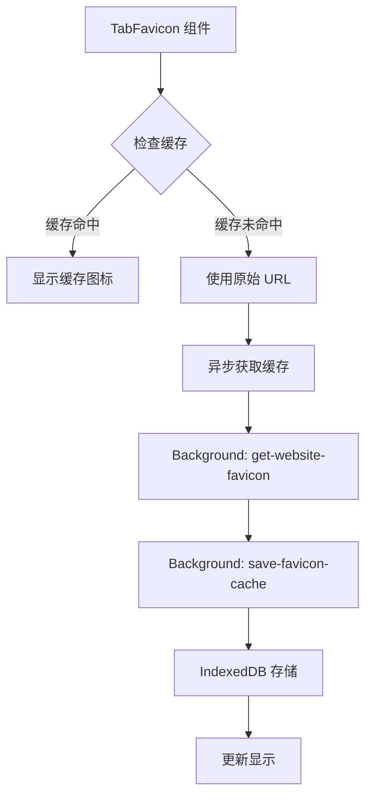

# Craz Chrome Extension

一个基于 Plasmo 框架的智能标签页管理 Chrome 扩展，支持快速切换标签页和书签管理。

## ✨ 功能特性

- 🚀 **快速标签页切换**: 按 `C` 键快速打开标签页管理界面
- 🔍 **智能搜索**: 支持按标题、URL 搜索标签页
- 📚 **书签管理**: 一键添加书签，支持标签分类
- ⚡ **实时同步**: 标签页状态实时更新
- 🎨 **现代 UI**: 基于 Tailwind CSS 的美观界面
- 🔒 **隐私保护**: 仅在需要时显示，不干扰正常浏览
- 🖼️ **智能图标缓存**: 自动缓存网站 favicon，提升加载速度

## 🏗️ 技术架构

### 前端 (Chrome Extension)

- **框架**: Plasmo + React + TypeScript
- **状态管理**: React Query (TanStack Query)
- **样式**: Tailwind CSS v3
- **图标**: Lucide React
- **架构**: Feature-Sliced Design (FSD)

### 后端 (API 服务)

- **框架**: Hono.js
- **运行时**: Cloudflare Workers
- **数据存储**: Cloudflare KV
- **数据验证**: Zod

### 🎯 Chrome 扩展架构设计

#### Background Script 作为服务中间层

遵循 **Background 作为服务的中间接口层** 的架构原则：

```
UI 组件 → Background Messages → Chrome APIs/External Services → Background → UI
```

**核心职责**：

- 🌐 **服务层**: 作为扩展的统一服务层和中间接口
- 🔌 **API 集中化**: 所有外部服务调用集中在 background 处理
- 🔐 **权限管理**: 敏感权限和 API 密钥统一管理
- 💾 **数据缓存**: 实现数据缓存和状态管理
- 📡 **消息通信**: 通过 @plasmohq/messaging 处理跨组件通信

#### Background Messages 接口

| Message Handler | 功能 | 数据流向 |
|---|---|---|
| `get-tabs` | 获取 Chrome 标签页 | Background → Chrome API |
| `switch-tab` | 切换标签页 | UI → Background → Chrome API |
| `close-tab` | 关闭标签页 | UI → Background → Chrome API |
| `get-bookmarks` | 获取 Chrome 书签 | Background → Chrome API |
| `get-website-favicon` | 获取网站 favicon | Background → External URL |
| `check-favicon-availability` | 检测 favicon 资源可用性 | UI → Background → HEAD 请求 |
| `get-favicon-cache` | 读取 favicon 缓存 | UI → Background → IndexedDB |
| `save-favicon-cache` | 保存 favicon 缓存 | Background → IndexedDB |

### 🖼️ Favicon 缓存系统

#### 架构设计

采用 **两层缓存架构** 确保性能和可靠性：



#### 存储策略

**Chrome Storage Sync (8KB 限制)**

- 基本书签信息：`StoredBookmark` 接口
- 数据：ID、标题、URL、排序
- 优势：跨设备同步

**IndexedDB (扩展独立存储)**

- Favicon 缓存：base64 图片数据
- 格式：`timestamp____base64`
- 优势：大容量、本地性能

#### 数据流向

**1. 缓存读取流程**

```
TabFavicon → get-favicon-cache → IndexedDB → 返回 base64 或 null
```

**2. 缓存写入流程**

```
TabFavicon → get-website-favicon → 外部网站 → save-favicon-cache → IndexedDB
```

**3. 缓存策略**

- ✅ 24小时过期机制
- ✅ 自动创建数据库结构
- ✅ 默认图标回退 (方形外链箭头)
- ✅ 错误处理和日志记录

#### 组件设计

**Favicon 组件逻辑**

1. 检查是否为 base64 格式 → 直接使用
2. 检查是否为特殊 URL (chrome://) → 使用默认图标
3. 通过 `get-favicon-cache` 查询缓存
4. 缓存命中 → 显示缓存图标
5. 缓存未命中 → 显示原始 URL + 异步获取缓存

**关键优势**

- 🔄 **统一管理**: 所有 IndexedDB 操作集中在 background
- ⚡ **性能优化**: 缓存机制避免重复网络请求
- 🛡️ **错误恢复**: 多层回退策略确保图标始终显示
- 🔧 **可维护性**: 清晰的关注点分离

## 📁 项目结构

```
craz/
├── source/                       # 前端源码
│   ├── components/               # 通用组件
│   │   └── favicon.tsx           # Favicon 组件
│   ├── features/                 # 功能模块
│   │   └── tab-switcher/         # 标签页切换功能
│   │       ├── ui/               # UI 组件
│   │       ├── model/            # 业务逻辑
│   │       └── types.ts          # 类型定义
│   └── shared/                   # 共享资源
│       ├── api/                  # API 服务
│       ├── hooks/                # 自定义 hooks
│       ├── types/                # 通用类型
│       └── utils/                # 工具函数
├── background/                   # Background Scripts
│   └── messages/                 # Background Message Handlers
│       ├── get-tabs.ts           # 获取标签页
│       ├── switch-tab.ts         # 切换标签页
│       ├── close-tab.ts          # 关闭标签页
│       ├── get-bookmarks.ts      # 获取书签
│       ├── get-website-favicon.ts # 获取网站 favicon
│       ├── check-favicon-availability.ts # 检测 favicon 资源可用性
│       ├── get-favicon-cache.ts  # 读取 favicon 缓存
│       └── save-favicon-cache.ts # 保存 favicon 缓存
├── contents/                     # Content Scripts
├── popup/                        # 扩展弹窗
├── api/                          # 后端 API 服务
│   ├── src/
│   │   ├── routes/               # 路由处理
│   │   ├── services/             # 业务服务
│   │   └── schemas/              # 数据验证
│   └── wrangler.toml             # Cloudflare 配置
└── assets/                       # 静态资源
```

## 🚀 快速开始

### 前端开发

1. **安装依赖**:

```bash
pnpm install
```

2. **启动开发服务器**:

```bash
pnpm dev
```

3. **构建扩展**:

```bash
pnpm build
```

### 后端部署

1. **进入 API 目录**:

```bash
cd api
pnpm install
```

2. **创建 KV 存储**:

```bash
wrangler kv:namespace create "BOOKMARKS_KV"
```

3. **更新配置**: 将生成的 KV 命名空间 ID 更新到 `wrangler.toml`

4. **部署到 Cloudflare**:

```bash
pnpm deploy
```

## 🎯 使用方法

1. **安装扩展**: 在 Chrome 中加载解压的扩展程序
2. **激活界面**: 在任意网页按 `C` 键
3. **搜索标签页**: 在搜索框中输入关键词
4. **切换标签页**: 点击标签页项目快速切换
5. **管理书签**: 使用书签按钮添加当前标签页到书签

## 🔧 技术实现详解

### Chrome 扩展独立存储

Chrome 扩展拥有**独立的存储空间**，与网站页面完全隔离：

- ✅ **IndexedDB 隔离**: 每个扩展有独立的 IndexedDB 存储
- ✅ **跨组件共享**: Background、Content Script、Popup 共享同一存储
- ✅ **扩展标识**: 通过扩展 ID 进行存储标识
- ✅ **权限管理**: 只有扩展本身可访问其存储

### 消息通信架构

使用 `@plasmohq/messaging` 实现组件间通信：

```typescript
// UI 组件调用 Background
const response = await sendToBackground({
  name: 'get-favicon-cache',
  body: { url: 'https://example.com' }
})

// Background Message Handler
const handler: PlasmoMessaging.MessageHandler = async (req, res) => {
  // 处理请求逻辑
  res.send({ success: true, data: result })
}
```

### 存储配额解决方案

**问题**: Chrome Storage Sync 单项 8KB 限制
**解决方案**: 双存储策略

```typescript
// Chrome Storage Sync - 基本信息
interface StoredBookmark {
  id: string
  title: string
  url: string
  order: number
}

// IndexedDB - 大数据缓存
interface FaviconCache {
  url: string
  data: string // "timestamp____base64"
}
```

### 被动事件监听器问题

**问题**: `Unable to preventDefault inside passive event listener`
**解决方案**: 使用原生 `addEventListener` 替代 `ahooks.useEventListener`

```typescript
// ❌ 问题代码
useEventListener('keydown', handler) // 可能使用被动监听器

// ✅ 解决方案
useEffect(() => {
  const handleKeyDown = (event: KeyboardEvent) => {
    event.preventDefault() // 可以正常工作
  }
  
  document.addEventListener('keydown', handleKeyDown, { passive: false })
  return () => document.removeEventListener('keydown', handleKeyDown)
}, [])
```

### Favicon 获取策略

多层回退策略确保图标始终可用：

```typescript
1. 检查 IndexedDB 缓存 (最快)
   ↓ 缓存未命中
2. 使用 HEAD 请求检测资源可用性 (轻量级检测)
   ↓ 资源可用
3. 显示原始 favIconUrl + 异步获取缓存
   ↓ 资源不可用 OR HEAD 请求失败
4. 获取网站 HTML 解析 favicon URL
   ↓ 解析失败
5. 尝试默认路径 /favicon.ico
   ↓ 仍然失败
6. 使用默认图标 (方形外链箭头)
```

### 性能优化策略

**缓存机制**

- 24小时本地缓存避免重复请求
- 异步加载不阻塞 UI 渲染
- 预加载常用网站图标

**网络优化**

- 超时控制避免长时间等待
- 并发限制防止过多网络请求
- 错误重试机制提高成功率

**UI 性能**

- React.memo 防止不必要重渲染
- 虚拟滚动处理大量标签页
- 防抖搜索减少计算频率

## 🔧 开发规范

### 代码哲学
>
> 代码是给人看的，只是顺便给机器运行

### 架构原则

- 遵循 Feature-Sliced Design (FSD) 架构
- 单一职责原则，功能模块化
- 类型安全，严格的 TypeScript 检查

### 代码规范

- 使用 ESLint + Prettier 保持代码风格
- 工具函数必须编写 Vitest 测试
- 组件使用 Tailwind CSS 样式
- 时间处理统一使用 date-fns

### Background Messages 开发规范

**文件命名**: `kebab-case.ts` (如: `get-favicon-cache.ts`)

**接口定义**:

```typescript
export interface RequestType {
  // 请求参数
}

export interface ResponseType {
  success: boolean
  // 响应数据
  error?: string
}
```

**Handler 实现**:

```typescript
const handler: PlasmoMessaging.MessageHandler<
  RequestType,
  ResponseType
> = async (req, res) => {
  console.log("[Background] 操作描述:", req.body)
  
  try {
    // 业务逻辑
    res.send({ success: true, /* 数据 */ })
  } catch (error) {
    console.error("[Background] 错误信息:", error)
    res.send({ 
      success: false, 
      error: error instanceof Error ? error.message : "操作失败" 
    })
  }
}
```

### 组件开发规范

**Favicon 相关组件**:

- 通过 Background Messages 操作 IndexedDB
- 不直接使用 `indexedDB` API
- 实现加载状态和错误回退
- 支持默认图标显示

**事件处理**:

- 避免被动事件监听器问题
- 明确设置 `{ passive: false }`
- 优先使用原生 `addEventListener`

### 存储策略规范

**Chrome Storage Sync**:

- 仅存储必要的同步数据 (< 8KB)
- 不存储大型二进制数据
- 支持跨设备同步

**IndexedDB**:

- 存储大型缓存数据
- 使用 `CrazExtensionDB` 数据库名
- 实现过期机制和清理策略

### 性能最佳实践

**缓存策略**:

- 优先使用本地缓存
- 设置合理的过期时间
- 实现优雅的降级方案

**网络请求**:

- 使用超时控制
- 实现重试机制
- 避免并发冲突

**UI 优化**:

- 使用 React.memo 优化渲染
- 实现加载状态指示
- 提供错误边界处理

## 📋 API 接口

### 书签管理

- `GET /bookmarks` - 获取书签列表
- `POST /bookmarks` - 创建书签
- `PUT /bookmarks/:id` - 更新书签
- `DELETE /bookmarks/:id` - 删除书签
- `GET /bookmarks/search` - 搜索书签
- `GET /bookmarks/tags` - 获取标签列表

详细 API 文档请查看 [api/README.md](./api/README.md)

## 🤝 贡献指南

1. Fork 项目
2. 创建功能分支: `git checkout -b feature/amazing-feature`
3. 提交更改: `git commit -m 'Add amazing feature'`
4. 推送分支: `git push origin feature/amazing-feature`
5. 提交 Pull Request

## 📄 许可证

MIT License - 详见 [LICENSE](LICENSE) 文件

## 🙏 致谢

- [Plasmo](https://www.plasmo.com/) - 优秀的浏览器扩展开发框架
- [Hono](https://hono.dev/) - 轻量级 Web 框架
- [Cloudflare Workers](https://workers.cloudflare.com/) - 边缘计算平台
